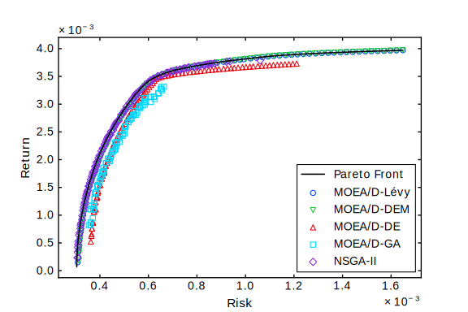

# Solving Portfolio Optimization Problems Using MOEA/D and Lévy Flight

## Python version and libraries

- Python 3.7.4 are used in the experiments.
- Check alias for python3 and edit ```.sh``` files. (If the alias is ```python3```, change ```python``` to ```python3```. **A better way is to use ```pyenv``` and set ```pyenv global 3.7.4```.**)
- Following libraries are required,
  + numpy
  + scipy
  + pandas
  + matplotlib
  + seaborn

## How to use

1. Open terminal
2. Run ```run.sh```
3. Program will create a folder named ```tmp``` and save simulation results in this folder
4. Copy folder ```process_script``` into ```tmp```
5. Enter ```process_script```
6. Run file ```run.sh``` in ```process_script``` folder
7. Program will create ```images```, ```num_res``` and ```report``` folders, containing images, metrics and statistical issues, respectively.

## Experimental data

The data is included in file ```DATA.tar.gz``` in this repository. After unzip, there are three folders namely, ```experimental_results```, ```discussion``` and ```parameter_tuning_results```, for the data (numerical values and graphs) of experiments, discussion and parameter tuning, respectively.

## Notice

- This program does not contain statistical test. Please use R or other statistical software to implement Wilcoxon Rank-Sum Test.
- You may get a slight difference in numerical results, for [machine epsilon](https://en.wikipedia.org/wiki/Machine_epsilon) issues. But **the statistical conclusion should not change.**
- The autoscripts can only run for all algorithms on all datasets. If you want to get results on single dataset or single algorithm, please edit and run ```run_xxx.py``` files. You may also edit processing scripts. However, to compute hypervolume, you may need get results for all algorithms on one dataset at first.
- Please feel free to contact at *heyf95318@yahoo.co.jp* or *s1820747@s.tsukuba.ac.jp* if you have any problem about the code.

## Plotting sample



## File tree

```
.
├── dat ........................................ Folder for benchmark
│   ├── port1.txt .............................. Hangseng
│   ├── port2.txt .............................. DAX 100
│   ├── port3.txt .............................. FTSE 100
│   ├── port4.txt .............................. S&P 100
│   ├── port5.txt .............................. Nikkei
│   ├── portef1.txt ............................ Hangseng Pareto Front
│   ├── portef2.txt ............................ DAX 100 Pareto Front
│   ├── portef3.txt ............................ FTSE 100 Pareto Front
│   ├── portef4.txt ............................ S&P 100 Pareto Front
│   └── portef5.txt ............................ Nikkei Pareto Front
├── DATA.tar.gz ................................ Raw data for experimental results and discussion
├── dec_reprod.py .............................. Mutation for MOEA/D
├── domina.py .................................. Tools for NSGA-II
├── dom_reprod.py .............................. Mutation for NSGA-II
├── LICENSE
├── metric.py .................................. Evaluation metrics
├── moead.py ................................... NBI-MOEA/D framework
├── nbi_decomp.py .............................. NBI-style Tchebycheff
├── nsga2.py ................................... NSGA-II framework
├── plotting_sample.svg ........................ Sample plot for experimental results
├── prob.py .................................... Mean-Variance model
├── process_script ............................. Folder for post processing
│   ├── compute_metric.py ...................... Metrics calculation
│   ├── dat .................................... Folder for Pareto Front
│   │   ├── portef1.txt ........................ Hangseng Pareto Front
│   │   ├── portef2.txt ........................ DAX 100 Pareto Front
│   │   ├── portef3.txt ........................ FTSE 100 Pareto Front
│   │   ├── portef4.txt ........................ S&P 100 Pareto Front
│   │   └── portef5.txt ........................ Nikkei Pareto Front
│   ├── get_best.py ............................ Retrieve runs with best IGD
│   ├── metric.py .............................. Evaluation metrics
│   ├── plot.py ................................ Plotting scripts
│   ├── run.sh ................................. Run file to do post processing
│   └── stat.py ................................ Statistical processing
├── README.md .................................. Instruction
├── repair_tool.py ............................. Constraint handling technique
├── run_benchmark.sh ........................... Run file to test on one benchmark
├── run_dem.py ................................. Run MOEA/D-DEM
├── run_de.py .................................. Run MOEA/D-DE
├── run_ga.py .................................. Run MOEA/D-GA
├── run_lvxm.py ................................ Run MOEA/D-Levy
├── run_lvx.py ................................. Run LEVY
├── run_norm.py ................................ Run NORM
├── run_nsga2.py ............................... Run NSGA-II
├── run.sh ..................................... Run file to do whole experiments
└── run_unif.py ................................ Run UNIF
```
